It's no secret that buying Guitar Hero controllers has gotten very expensive lately. While you may be able to get lucky at thrift stores, there's no guarantees out there for quality.

Fast forward to 2023 and there's some glimmers of hope. The Clone Hero community has banded together to create all sorts of modifications like mechanical frets, 3D printable, drop-in replacement parts, and even full guitar bodies. 

In this article, I will explain how I built my own Polybar, courtesy of [roadsidebomb](https://github.com/roadsidebomb/). Many of the steps have already been discussed in other guides, such as those that explain how to retrofit an Arduino into an official controller, but the Polybar is a little different due to it being entirely 3D printed.

This guide includes the instructions I followed on preparing the printed parts, as well as wiring and configuring the electronics. Let's begin! 

## Pre-requisites

Before proceeding, you'll need the following:

 - 3D printer and filament
 - 7x full-size, mechanical keyboard switches (5 linear, 2 clicky)
 - 2 M5 20mm bolts
 - 1x M5 35mm bolt
 - 3 M5 x 10 x 7mm threaded inserts
 - 3x 6x6x4.5mm microswitches
 - 1x Arduino compatible joystick board
 - Colour-coded strands of AWG 30-32 wire
 - 1x Adruino Pro Micro (or clone)
 - 1x USB-C cable
 - Soldering iron
 - Hot glue
 - Sandpaper or filing tool
 - Pliers
 - Super glue
 - [Ardwiino Guitar Configuration Tool](https://sanjay900.github.io/guitar-configurator/) by Sanjay
 - [The latest project files](https://github.com/roadsidebomb/Polybar-Minibar-3D-Print-Files) (credits to roadsidebomb on Github) **OR** Bengyboo on printables has made a [modified Flying V frame](https://www.printables.com/model/381832-flying-v-polybar-frame)  that allows for more secure installation.
 - Heatgun (Optional)
 - Solder flux (Optional)

## Print Process

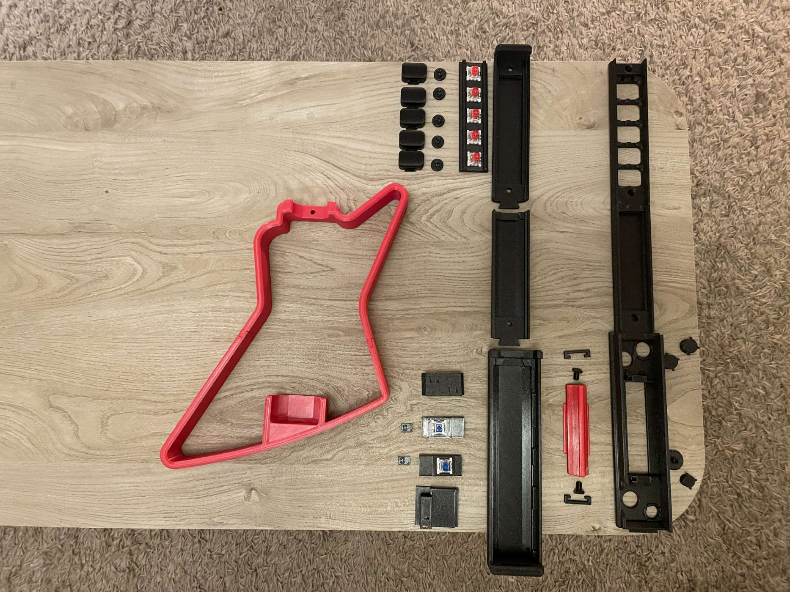

First we must discuss the printing process. Once downloading the files from roadsidebomb's Github, simply open them in your preferred slicing program (I'm using Prusaslicer). 

Parts can be printed in two batches: In one batch you'll have the internal boards used to hold switches in place, as well as any button heads; in the second, you'll have the body of the Polybar itself. The body can be printed either with or without an extension that sits between the strumbar and the frets to give it a more traditional controller length.

## Test Fitting

Before we assemble anything, it's important to test fit the parts to ensure everything plays together nicely. It's likely you'll need to make some minor adjustments to the guitar before starting the main portion of the build. Nothing too extreme, we just want to remove as much support material as possible on the internal boards, dovetail connectors, and well, anything else.

One you're satisfied that everything is smooth, the test fit can begin!

**Note:** The Polybar comes with an optional extension to give a slightly longer neck. I decided to use this, and glued the whole top section together at the dovetail joints to make disassembly much simpler. This is optional, but just thought you should know!

### Strum Case Assembly

Before assembling the strum case, take the two internal strum bar boards and place a blue switch in either one. On top of the switch, you'll need the rectangular shaped switch cap to be placed like so:

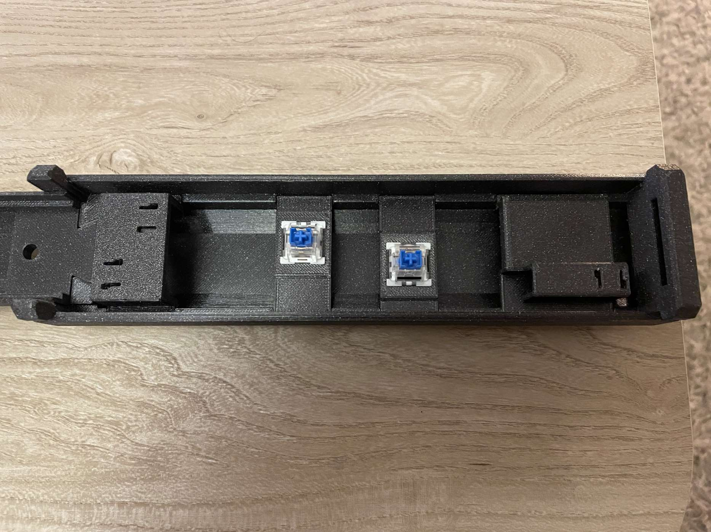

The joystick board goes at the bottom, the two blue switch holders go in the middle, and the two microswitch holders go at the top. There are notches along the small railings on the inside of the case to help you place things in the right location, so I tend to slide these along until I get a good fit.

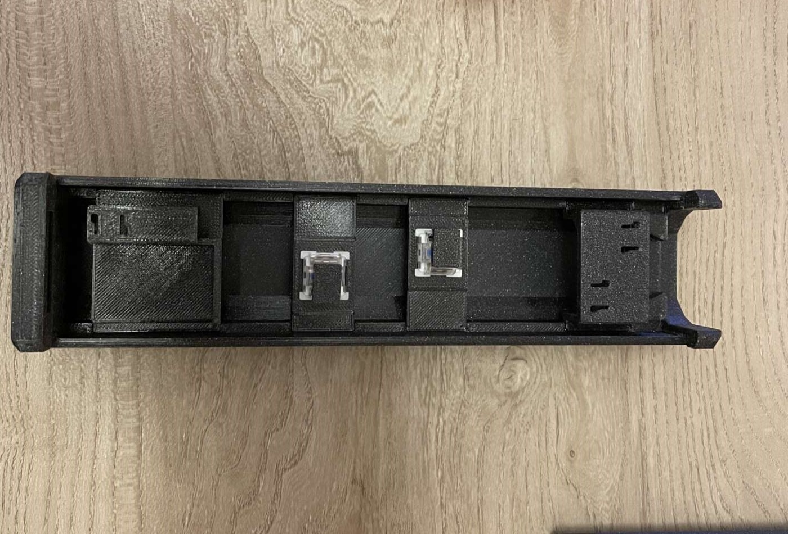

Now we move to the top section of the strum box. We first want to get the actual strum bar itself installed. To do this, lay the strum bar itself inside and then take the two plungers and insert them through the raised sections located either side of the strum bar. Flip the piece around and move the strum bar from up to down and ensure everything operates smoothly. If it does, flip the board around once more and place the plunger covers over the top of the raised sections. These will prevent the plungers from accidentally falling out. 

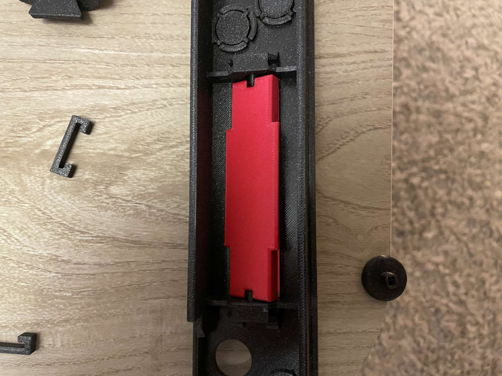

Another thing to do would be to check that the buttons fit into their respective slots. The top two buttons are the same size, and the bottom button is slightly smaller. We won't be able to check the joystick head fit just yet, but you can always lay it on top to see if it covers the hole. Be sure to remove these after you've verified that everything fits.

### Fret Button Assembly

To test the fret button assembly, we first want to place the linear switches into the 5 slots on the internal board. 

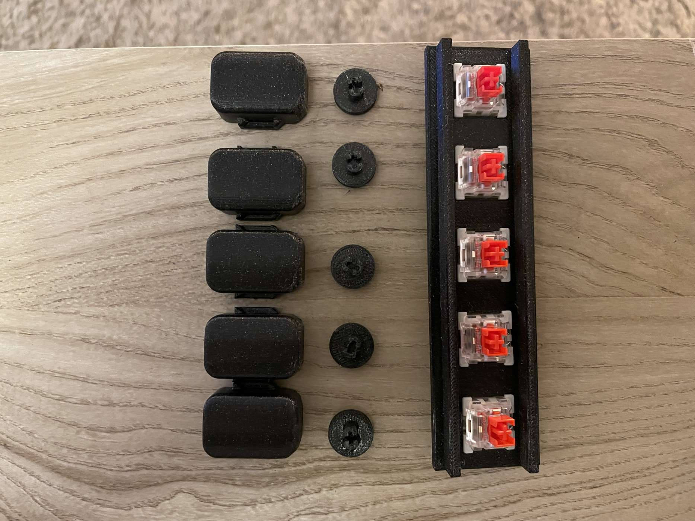

Simply press each switch into place until you hear a click. After that, insert the switch caps into each switch

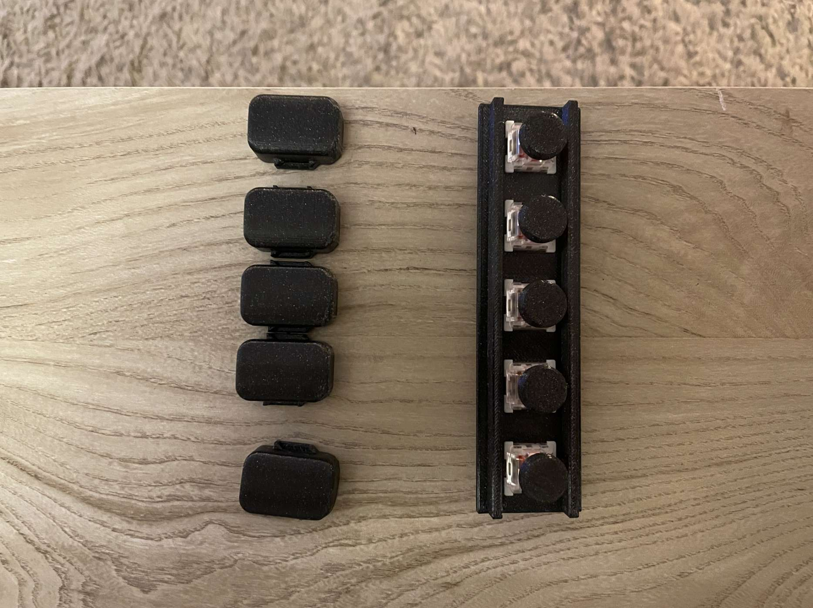

We can now slide the fret board into the bottom half of the neck shell. Similarly to the strum case buttons, there are notches to help you find the right location.

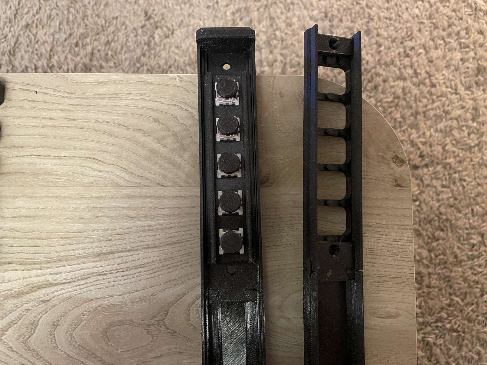

Once this is in place, take the fret buttons and place them on top of each switch cap. Line them up so that they're all straight to make the next step a bit easier.

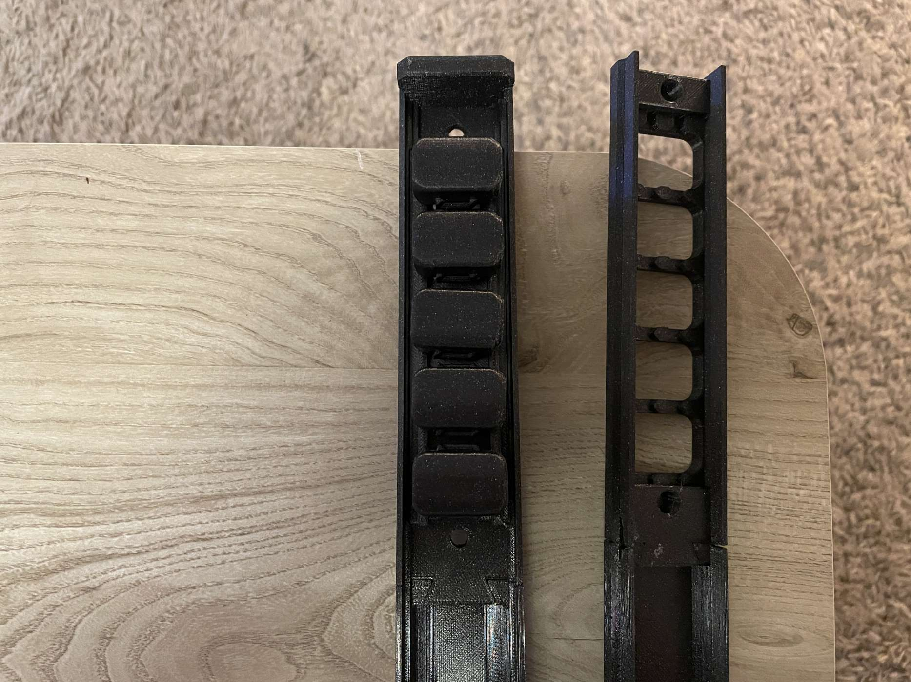

The fret buttons have a tear drop cut out on the bottom to make removing them a bit easier, but the orientation that you install them in doesn't really matter (These buttons require some sanding, so I tend to orient them so that the sanded side is facing away from me when holding the guitar).

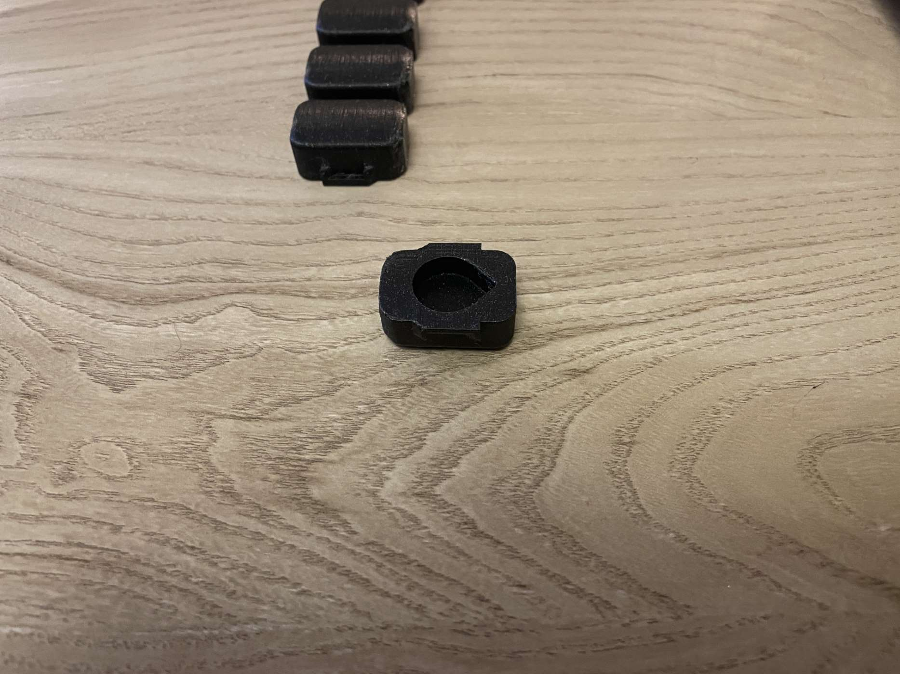

### Closing the Polybar

Looking at the top side of the strum bar, the bottom has a triangle that is designed to be inserted into the bottom casing at an angle. 

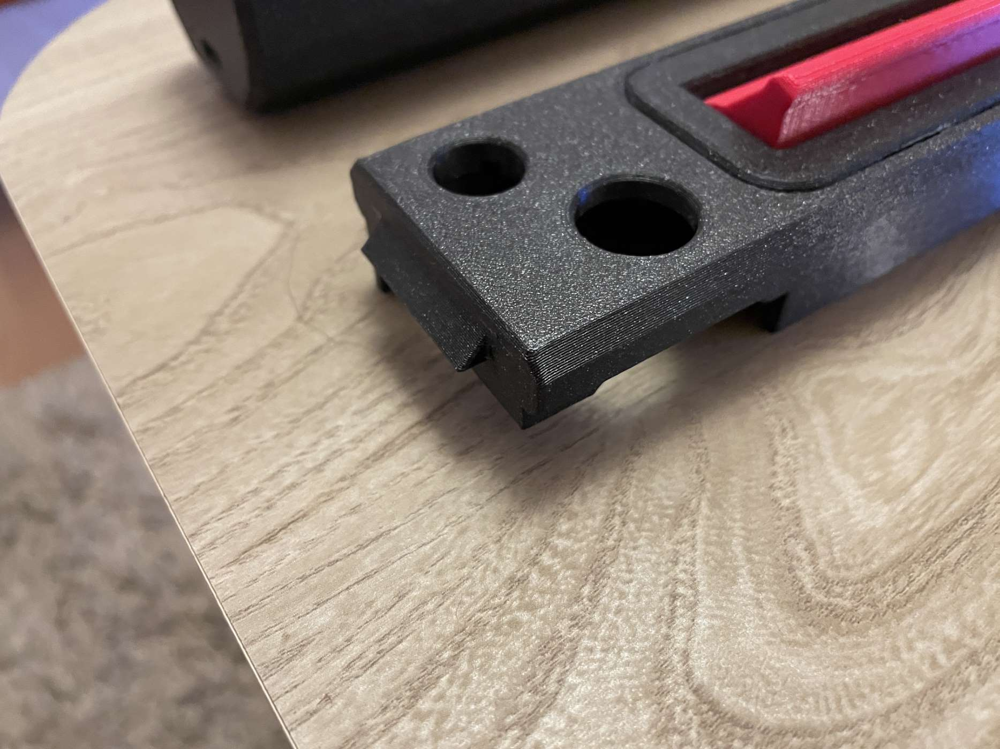

To fit both sides of the polybar together, simply lay the top of the shell into the bottom at an angle. You'll see that the trianglular piece above slots into a cut out on the bottom shell. Once these are lined up, lower the top portion downward until both pieces clamp together. You may need to wiggle the pieces around a bit to get everything sliding down correctly, but take your time; it'll fit!

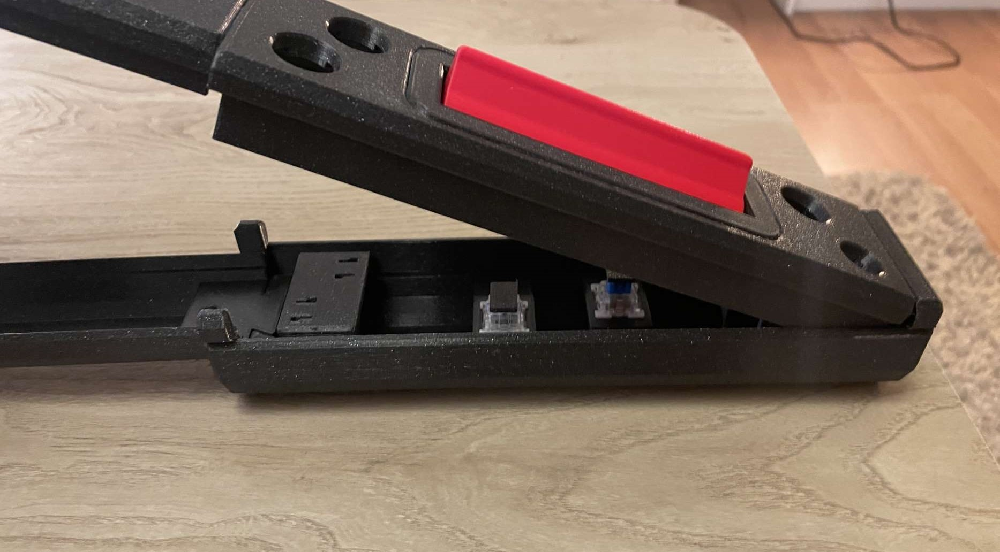

**Note:** If you too glued the top part together, try moving from the bottom of the shell upward, clicking each part together as you go. This should avoid excess strain on the joints. 

If everything fits; congratulations! Now on to the shell.

### Shell Assembly

Shell assembly will vary depending on which guitar shape you choose, but the process is relatively uniform.

Each shell comes in two parts; one top, one bottom. The top section can (and probably should) be glued together to ensure a nice even fit.

If your Polybar is assembled, you first need to take the top case off and remove the two neck pieces. This leaves you with just the strum case. The strum case slides into the shell at an angle, and can sometimes feel a bit uncomfortable. Be persistent, and don't be afraid to bend the plastic pieces slightly.

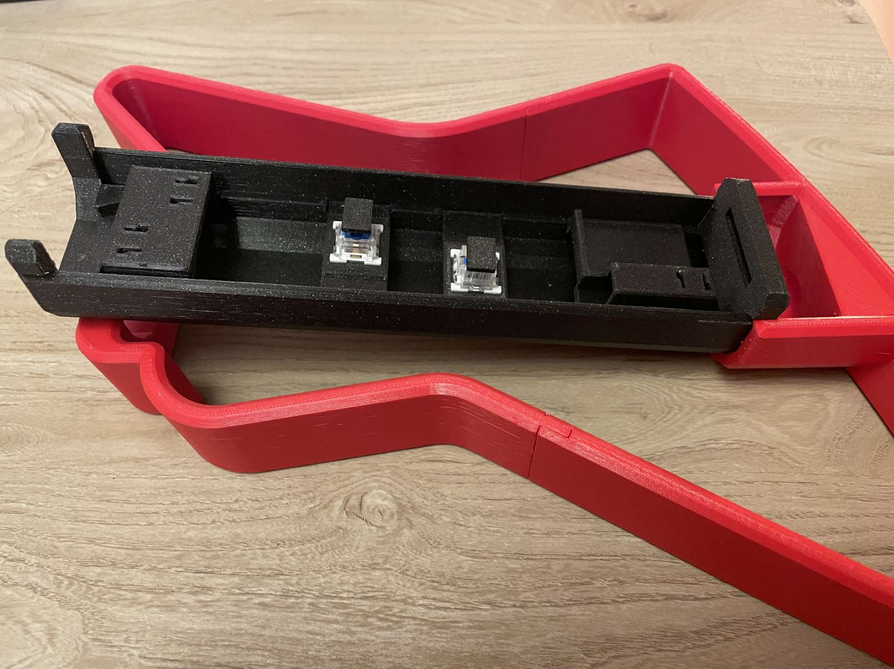

If the fit is too tight, feel free to file away some of the plastic in the lower portion. I do recommend doing this, especially if you'll be swapping frames out quite often. 

**Note:** In the pre-requisites, I have listed alternative downloads for a flying V shell that my friend modified. This allows the Polybar and the frame to be secured via one M5 35mm bolt.

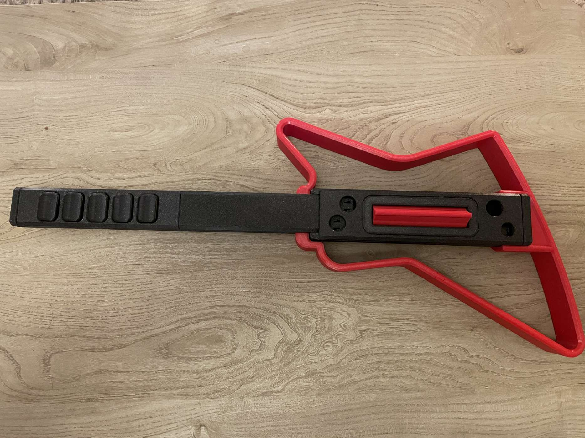

Once you're happy that the body of your Polybar is secure, you can go ahead and reverse those prior instructions to get everything disassembled.

## Initial Soldering Joints

Now, the fun part; soldering! 

Soldering novices need not worry. Before this project, I hadn't touched a soldering iron since my days in secondary school and mine turned out just fine. Sure, it's not perfect, but it works! 

### Switches

First, let's look at preparing our fret button/strum bar switches. 

Each switch requires two wires: one of them is our ground wire, the other gets connected to an available pin on the Pro Micro. 

### Fret Buttons/Strum Bar

For the fret buttons, cut 10 strands of wire measuring from top to bottom of your Polybar (2 green, 2 red, 2 yellow, etc). Without an extension, this works out to 40cm, and 55cm with an extension. I'd advise leaving an additional 5cm or so on the ends, just in case we need more. 

This is where the colour coded wire comes in extremely helpful. My kit came with all the fret button colours, apart from orange. For orange, I used one red wire and one yellow wire.

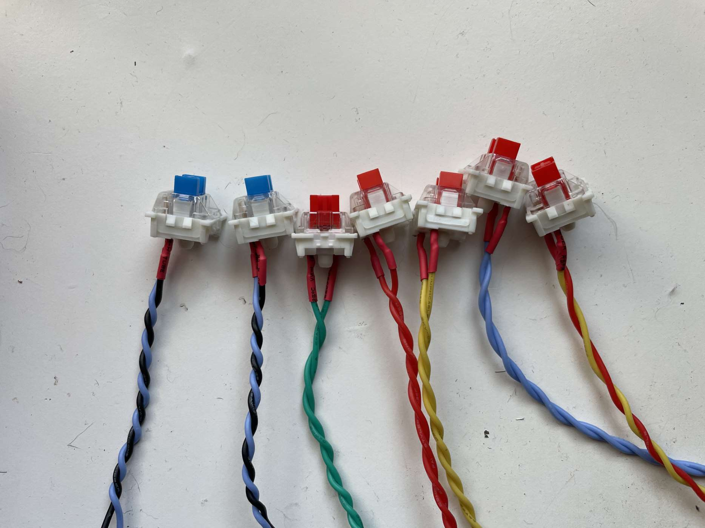

Once these are cut, solder one wire to each pin for all five fret buttons. For added security, install a piece of heatshrink around your solder joint, and then twist the wires around eachother to keep things tidy. 

Repeat this process for your two tactile strum bar switches, but feel free to cut much less wire. I found that 15cm worth did the trick for both buttons.

### Microswitches

This process is much the same for our three microswitches. A word of caution here, though: the mounts for these switches are keyed, and can thus only be soldered in a specific way. 

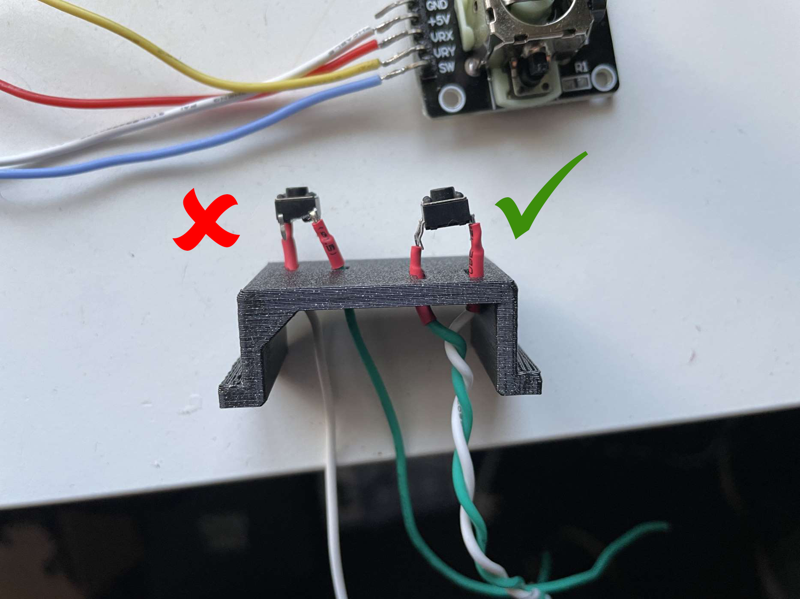

You **must** ensure that you solder the opposing pins on each switch. As you can see above, my first attempt resulted in me wiring up the wrong pins. To be sure, I'd recommend firstly dry fitting your switches into the mount to get the correct orientation. The printed part has a larger cut out for which pins you need to solder, and can be helpful if you get stuck. 

Once you've soldered everything correctly, insert the microswitches into their holding brackets, and once again twist the wires around to make everything neat. I like to add a dab of hot glue to the microswitch housing to keep them from moving around too much.

### Joystick

Your joystick board has five pins: GND (Ground), +5V, VRX, VRY and SW. 

Solder a piece of wire to each of these pins, but don't heat shrink them. The plastic mount that the joystick sits on has just enough allowance to permit the pins to arch their way over the little ridge. Heatshrinking this section would just make our lives more difficult.

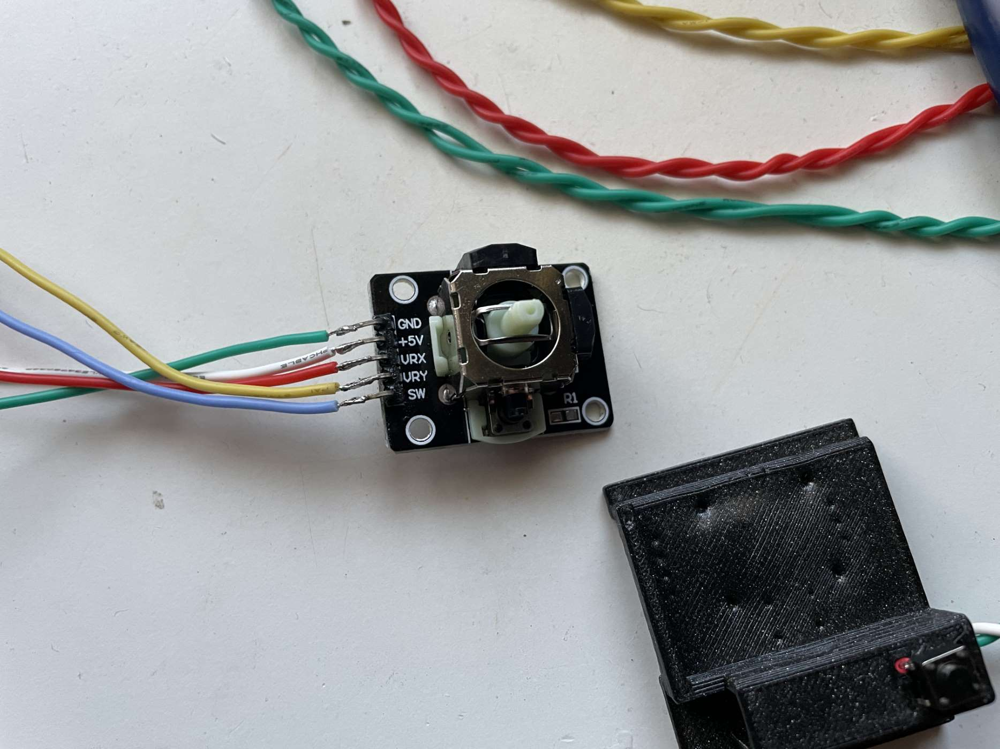

Something you can also do here is heat up the plastic mount so that the material is slightly flexible, and then press in the joystick board to create indents from the exposed solder joints underneath. This will help it sit nice and flush.

## Assembly 

With our main soldering joints made, we can now start to piece the Polybar together.

### Fret Buttons

For the fret buttons, I prefer to install the switches in an up-down-up-down configuration. This makes cable management just a tiny bit easier and prevents them from bunching up once the board is glued in place.

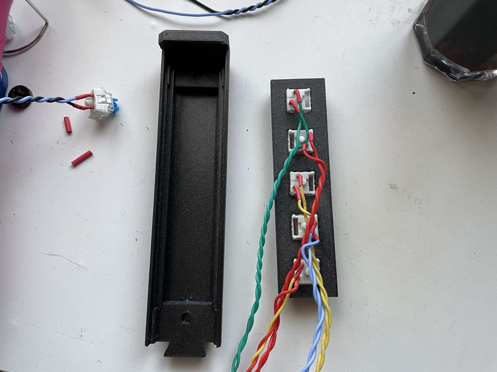

With your green fret placed in top position, distribute the wires evenly on either side of the board as they travel down the neck. Then, add a line of super glue on the rails that the fret board sits on, and press it in place. 

I used clamps to keep mine held together for about 5 minutes.

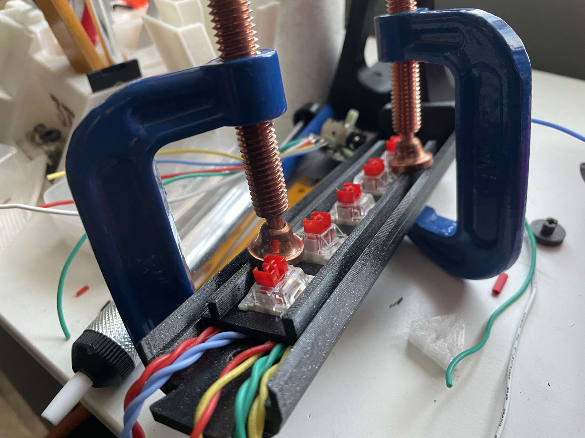

Bengyboo on printables designed these small 'C' shaped clips that go inside the extension section to keep the wires neat and tidy. I highly recommend them.

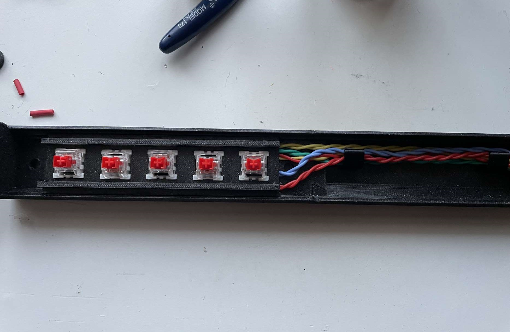

Once the glue is set, take one wire from each fret button and solder them to a single strand of red wire. This will act as our ground connection.

### Joystick

For the joystick, I decided to bridge the connection between both the microswitch on the Polybar and the switch in the joystick. This is optional, but will allow me to use both buttons to activate the same function in Clone Hero (I really couldn't think of what else I could map the joystick click to anyways!).

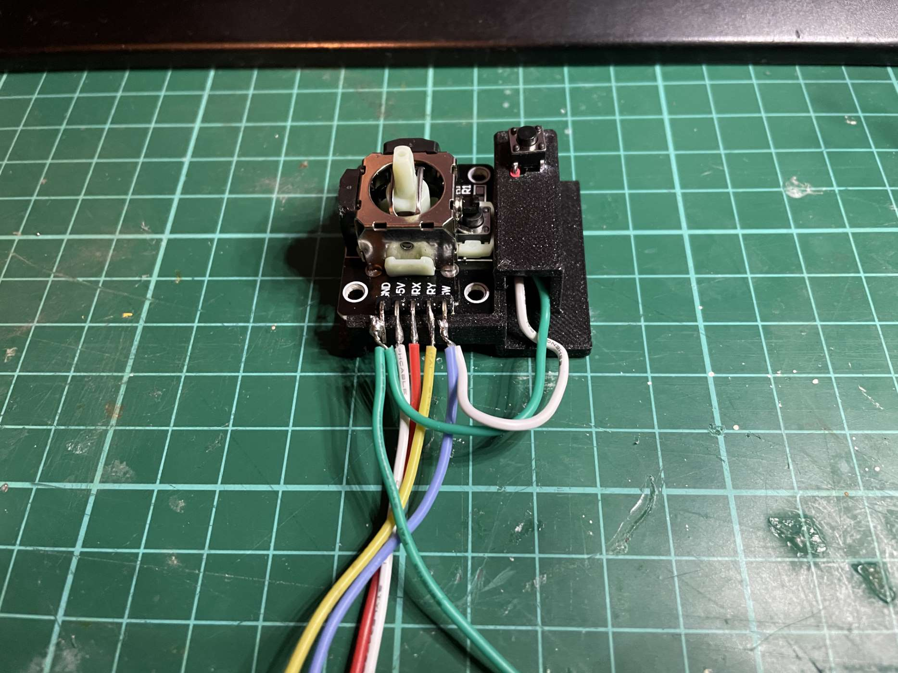

If you want to do this, simply solder one of your microswitch wires to the 'SW' pin on the joystick board, and one to the 'GND' pin.

Installing the joystick is very simple. Just place a dab of hot glue on the plastic bracket and seat the board in place. You may also want to glue in the microswitch, as it tends to wobble around a bit. 
### Strum Bar Switches

The boards for the strum bar switches have a slightly raised section denoting the top side of the board. These should face outwards when installed, as pictured above. 

Like with the fret buttons, feed the wire for your strum switches through the square cut out, and click the switches themselves into place. Then, take one wire from each switch (In my case, the black wire) and solder them to one wire for your ground.

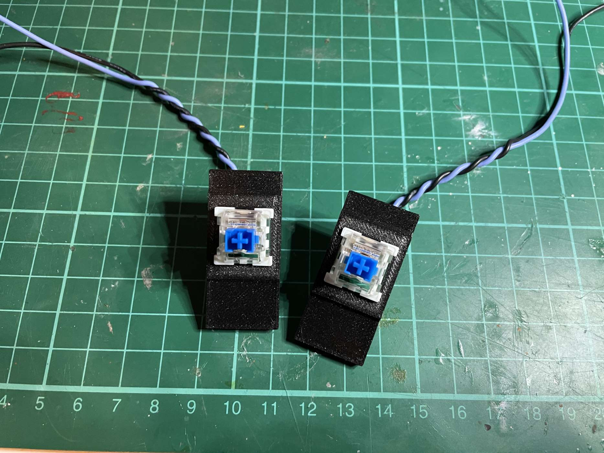

At this point, I glued my top microswitch board in place to keep the majority of the wiring contained. 

## Wiring To the Pro Micro

When wiring to the Pro Micro, I recommend laying a thin layer of flux over the top of the solder joints on the bottom of the board. This will ensure everything flows correctly and prevents double joints. 

You have two options with wiring to the Pro Micro. You can either solder your wires directly to the board, or you can solder on some pins to the board, and then solder your wires to those instead. For simplicity's sake, I chose to wire directly to the board. 

I'd first start by wiring all three of your ground connections to the GND pins to get them out of the way. 

After that, you'll want to solder all five of your fret buttons. I chose pins 2 through 7 for the fret buttons; 8 and 9 for the strum bar switches, and 10 and 11 for the remaining two microswitches.

For your joystick, wire the 5V pin to VCC; SW to pin 12; VRX to A0 and VRY to A1.

You should then be left with a board looking something like this.

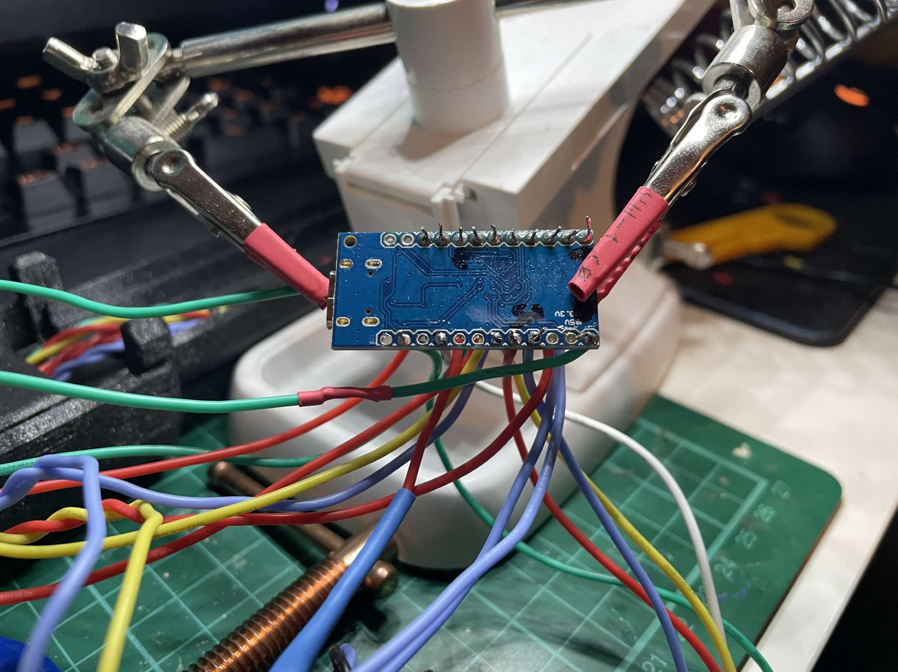

## Firmware Configuration

Before you set everything in its final resting place, a good idea would be to connect a USB cable to your Pro Micro and open sanjay's Guitar Configurator.

I won't go into too much detail about how to program your device, as sanjay has already created a [wonderful write-up](https://github.com/roadsidebomb/) on exactly that.

**However**, I did have some difficulty with the joystick. Specifically, getting it to work correctly. 

You'll want to set the Joystick X Axis to left or right on the stick, and Whammy to up or down.

With those assigned, click "Calibrate Joystick X Axis". A window will pop up asking you to mover your axis to the minimum value, in this case, we want to move the stick to the left and click okay. At the next prompt; do the opposite. Leave the deadzone as is and click okay. 

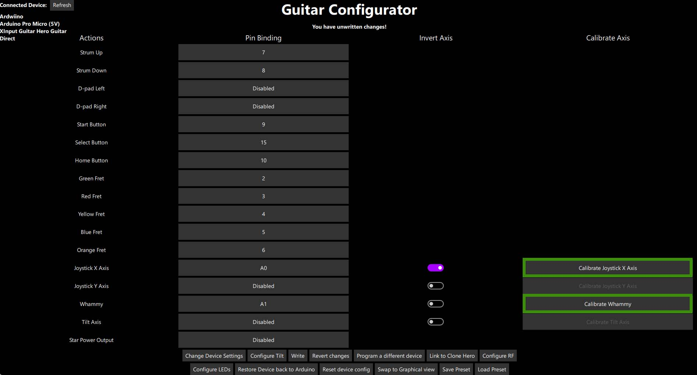

After that, click "Calibrate Whammy". In the window that pops up, move the joystick upwards, and in the next window; do the opposite. Leave the deadzone as is like before, and click okay.

You've now calibrated your controller's thumbstick/whammy!

## Finishing Touches

With everything wired up, it's now just a case of doing your best to get your cables stuffed in the strum bar case. I wish there was more method to the madness, but it really is just a case of put it where it will go. 

However, I can say this: make sure you glue the Pro Micro in place by the USB-C opening **before** glueing anything else down. This will help you make better judgements on how much slack there is in your wiring.

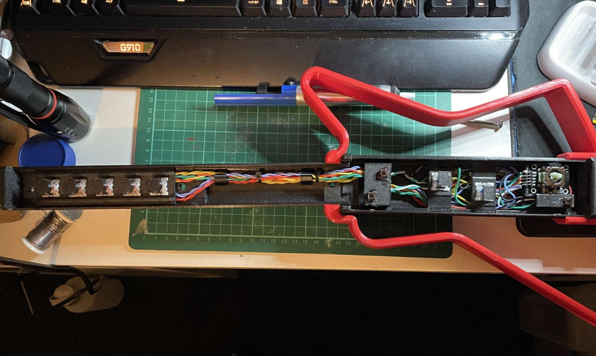

With your bottom shell finished, all that's left to do is to install the three threaded inserts into the top half of the shell. [This video](https://www.youtube.com/watch?v=KqSmCHr4fdA) by 3D Printing World should explain how to do that. 

Congratulations. Your Polybar is finished!